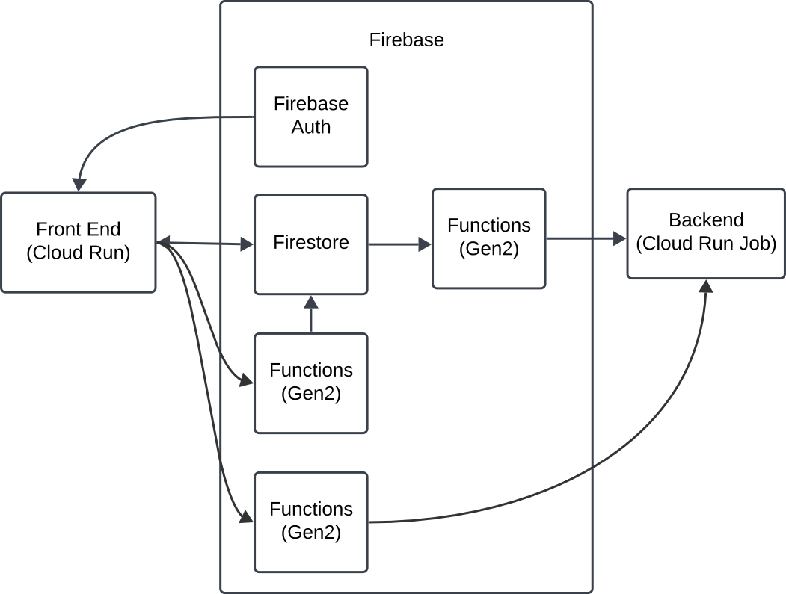

# Devai UI




Infra Sequence


User Browser
-> [Identity Platform](https://cloud.google.com/security/products/identity-platform#documentation) (User auth)
-> [Cloud Run](https://cloud.google.com/run/docs/quickstarts) (Frontend)
-> [Firestore](https://cloud.google.com/firestore#documentation) (DB)
-> [Cloud Function](https://cloud.google.com/functions#documentation) (Trigger)
-> [Cloud Run Job](https://cloud.google.com/run/docs/create-jobs) (Backend Job)

The Cloud Function is setup to trigger when a document is added in a `migrations/` collection. 

## Setup

Each directory has setup instructions in their respective readme files. There is a unified setup script that will build and deploy the assets needed by executing the following in the project's root directory

Authenticate with GCP:
```sh
gcloud auth application-default login
```

Be sure to set your gcloud project first

```sh
gcloud config set project YOUR_PROJECT_ID
```

Call the setup script

```sh
./setup.sh
```

## Console references

Links to related infra pages in GCP console

- [Identity Platform (Usert Auth)](https://pantheon.corp.google.com/customer-identity/providers)
- [Cloud Run (FrontEnd)](https://pantheon.corp.google.com/run)
- [Firestore (DB)](https://console.cloud.google.com/firestore/databases)
- [Cloud Functions (Trigger)](https://console.cloud.google.com/functions)
- [Cloud Run Jobs (Backend Job)](https://pantheon.corp.google.com/run/jobs)
